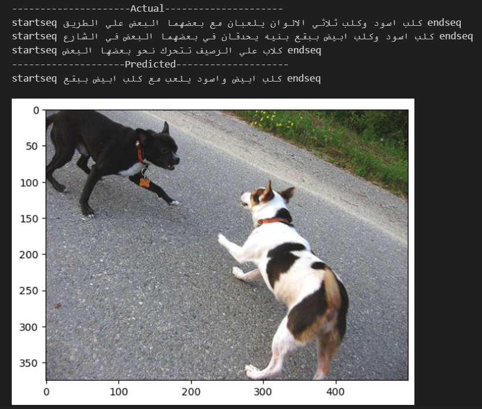

# Wasef
An Arabic image caption generator build from scratch 

## Quick start 
- Google colab
1- in Google colab add the notebook  
2- create a folder (resources) and add arabic_preprocessing.py to the folder
3- run the cells in the notebook

